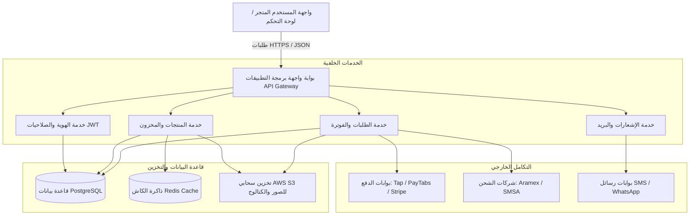
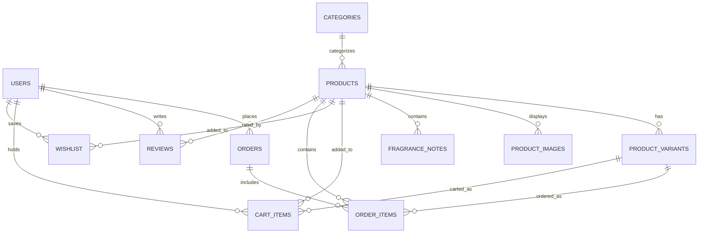

# مخطط البنية البرمجية وقاعدة البيانات لقصر العطور (Scent House)

يوضح هذا المستند مخطط البنية التحتية للنظام الخلفي (Backend) ومقترح هيكلية قاعدة البيانات (Database Schema) لتطبيق المتجر الإلكتروني الفاخر **Scent House**.

---

## 1. بنية النظام الخلفي (Backend Architecture)

تم تصميم النظام الخلفي ليكون **مستقلاً (Decoupled/Headless Backend)** يعتمد على نموذج **RESTful API** لتقديم البيانات وإدارتها، مما يسمح بأداء فائق وتكامل مرن وسريع مع واجهات العميل ولوحة الإدارة.



### التقنيات المقترحة:
* **بيئة التشغيل:** Node.js (مع Express.js أو NestJS) أو Python (مع FastAPI) لأداء عالٍ ومعالجة سريعة للطلبات.
* **إدارة الجلسات:** JSON Web Tokens (JWT) مشفرة ومخزنة في ملفات تعريف ارتباط آمنة (HttpOnly Cookies).
* **الكاش (Caching):** استخدام Redis لتخزين بيانات المنتجات الأكثر طلباً وتخفيف الضغط على قاعدة البيانات.
* **التخزين السحابي:** AWS S3 أو Cloudinary لتخزين صور العطور عالية الدقة وشعارات الماركة بشكل محسن وسريع التوصيل عبر شبكات توصيل المحتوى (CDNs).

---

## 2. مقترح هيكل قاعدة البيانات (Database Schema Schema)

تم استخدام قاعدة بيانات علاقاتية (Relational Database) مثل **PostgreSQL** لضمان تكامل البيانات وإدارة العمليات المعقدة مثل الطلبات والمدفوعات والمخازن بكفاءة وأمان كامل.



### الجداول المقترحة وتفاصيل الحقول (Tables & Fields)

#### 1. جدول المستخدمين (`users`)
يخزن بيانات العملاء والإداريين.
```sql
CREATE TABLE users (
    id SERIAL PRIMARY KEY,
    name VARCHAR(150) NOT NULL,
    email VARCHAR(150) UNIQUE NOT NULL,
    phone VARCHAR(20) UNIQUE NOT NULL,
    password_hash VARCHAR(255) NOT NULL,
    role VARCHAR(20) DEFAULT 'customer', -- ('customer', 'admin', 'editor')
    created_at TIMESTAMP DEFAULT CURRENT_TIMESTAMP,
    updated_at TIMESTAMP DEFAULT CURRENT_TIMESTAMP
);
```

#### 2. جدول الفئات (`categories`)
يخزن التصنيفات (رجالي، نسائي، مشترك، بوكسات هدايا).
```sql
CREATE TABLE categories (
    id SERIAL PRIMARY KEY,
    name_ar VARCHAR(100) NOT NULL,
    name_en VARCHAR(100) NOT NULL,
    slug VARCHAR(100) UNIQUE NOT NULL,
    image_url VARCHAR(255),
    created_at TIMESTAMP DEFAULT CURRENT_TIMESTAMP
);
```

#### 3. جدول المنتجات الرئيسية (`products`)
يحتوي على البيانات الأساسية للعطور.
```sql
CREATE TABLE products (
    id SERIAL PRIMARY KEY,
    category_id INT REFERENCES categories(id) ON DELETE SET NULL,
    name_ar VARCHAR(150) NOT NULL,
    name_en VARCHAR(150) NOT NULL,
    description_ar TEXT NOT NULL,
    description_en TEXT NOT NULL,
    base_price DECIMAL(10, 2) NOT NULL, -- السعر الأساسي
    is_featured BOOLEAN DEFAULT FALSE,  -- الأكثر مبيعاً
    is_new BOOLEAN DEFAULT TRUE,       -- الأحدث
    created_at TIMESTAMP DEFAULT CURRENT_TIMESTAMP,
    updated_at TIMESTAMP DEFAULT CURRENT_TIMESTAMP
);
```

#### 4. جدول أحجام العطور والأسعار للمتغيرات (`product_variants`)
يدعم الأحجام المختلفة لكل عطر (مثال: 50 مل، 100 مل).
```sql
CREATE TABLE product_variants (
    id SERIAL PRIMARY KEY,
    product_id INT REFERENCES products(id) ON DELETE CASCADE,
    size_ml INT NOT NULL, -- الحجم بالملل (50, 100, 200)
    price DECIMAL(10, 2) NOT NULL, -- السعر الخاص بهذا الحجم
    stock INT DEFAULT 0, -- كمية المخزون المتاحة
    sku VARCHAR(50) UNIQUE NOT NULL
);
```

#### 5. جدول النوتات العطرية والخصائص (`fragrance_notes`)
يحدد مكونات العطر الثلاثية الفاخرة (المقدمة، القلب، القاعدة).
```sql
CREATE TABLE fragrance_notes (
    id SERIAL PRIMARY KEY,
    product_id INT REFERENCES products(id) ON DELETE CASCADE,
    note_type VARCHAR(20) NOT NULL, -- ('top', 'heart', 'base')
    content_ar TEXT NOT NULL, -- المكونات بالعربية
    content_en TEXT NOT NULL  -- المكونات بالإنجليزية
);
```

#### 6. جدول صور المنتجات (`product_images`)
يتيح وجود معرض صور متعدد لكل منتج.
```sql
CREATE TABLE product_images (
    id SERIAL PRIMARY KEY,
    product_id INT REFERENCES products(id) ON DELETE CASCADE,
    image_url VARCHAR(255) NOT NULL,
    is_primary BOOLEAN DEFAULT FALSE,
    sort_order INT DEFAULT 0
);
```

#### 7. جدول سلة التسوق للمستخدمين (`cart_items`)
لحفظ حالة سلات المستخدمين المسجلين عبر الأجهزة.
```sql
CREATE TABLE cart_items (
    id SERIAL PRIMARY KEY,
    user_id INT REFERENCES users(id) ON DELETE CASCADE,
    product_id INT REFERENCES products(id) ON DELETE CASCADE,
    variant_id INT REFERENCES product_variants(id) ON DELETE CASCADE,
    quantity INT NOT NULL CHECK (quantity > 0),
    created_at TIMESTAMP DEFAULT CURRENT_TIMESTAMP
);
```

#### 8. جدول قائمة الأمنيات (`wishlist`)
```sql
CREATE TABLE wishlist (
    id SERIAL PRIMARY KEY,
    user_id INT REFERENCES users(id) ON DELETE CASCADE,
    product_id INT REFERENCES products(id) ON DELETE CASCADE,
    created_at TIMESTAMP DEFAULT CURRENT_TIMESTAMP,
    UNIQUE(user_id, product_id)
);
```

#### 9. جدول الطلبات (`orders`)
لتسجيل طلبات الشراء وحالة الشحن والدفع.
```sql
CREATE TABLE orders (
    id SERIAL PRIMARY KEY,
    user_id INT REFERENCES users(id) ON DELETE SET NULL,
    status VARCHAR(50) DEFAULT 'pending', -- ('pending', 'paid', 'processing', 'shipped', 'delivered', 'cancelled')
    total_amount DECIMAL(10, 2) NOT NULL,
    discount_amount DECIMAL(10, 2) DEFAULT 0.00,
    promo_code VARCHAR(50),
    payment_method VARCHAR(50) NOT NULL, -- ('credit_card', 'apple_pay', 'tabby', 'tamara', 'cash_on_delivery')
    shipping_fullname VARCHAR(150) NOT NULL,
    shipping_address TEXT NOT NULL,
    shipping_city VARCHAR(100) NOT NULL,
    shipping_phone VARCHAR(20) NOT NULL,
    shipping_cost DECIMAL(10, 2) DEFAULT 0.00,
    tracking_number VARCHAR(100),
    created_at TIMESTAMP DEFAULT CURRENT_TIMESTAMP,
    updated_at TIMESTAMP DEFAULT CURRENT_TIMESTAMP
);
```

#### 10. تفاصيل عناصر الطلب (`order_items`)
تخزن المنتجات والأسعار والكميات في لحظة الشراء لضمان دقة السجلات التاريخية.
```sql
CREATE TABLE order_items (
    id SERIAL PRIMARY KEY,
    order_id INT REFERENCES orders(id) ON DELETE CASCADE,
    product_id INT REFERENCES products(id) ON DELETE SET NULL,
    variant_id INT REFERENCES product_variants(id) ON DELETE SET NULL,
    quantity INT NOT NULL,
    price DECIMAL(10, 2) NOT NULL -- السعر الفعلي وقت الشراء
);
```

#### 11. جدول التقييمات والآراء (`reviews`)
لإظهار مراجعات العملاء بعد الشراء لتعزيز الثقة.
```sql
CREATE TABLE reviews (
    id SERIAL PRIMARY KEY,
    product_id INT REFERENCES products(id) ON DELETE CASCADE,
    user_id INT REFERENCES users(id) ON DELETE SET NULL,
    rating INT NOT NULL CHECK (rating >= 1 AND rating <= 5),
    comment TEXT,
    is_approved BOOLEAN DEFAULT FALSE,
    created_at TIMESTAMP DEFAULT CURRENT_TIMESTAMP
);
```

---

## 3. مسار رحلة البيانات ودورة حياة الطلب (Order Life Cycle)

1. **الكتالوج والتصفح:** يُحمل العميل الصفحة، يتم سحب المنتجات من `products` مع تفاصيل متغيراتها وصورها ونوتاتها عبر خدمة الكاتالوج (المحسنة باستخدام Redis Cache).
2. **سلة التسوق:** يضيف العميل المنتجات وتُخزن محلياً وجلسة قواعد البيانات في جدول `cart_items`.
3. **إتمام الطلب (Checkout):** يُدخل العميل بيانات الشحن، يختار طريقة الدفع، يتم تفعيل طلب مؤقت في جدول `orders` برمز حالة `pending` ويتم حجز المخزون مؤقتاً في جدول `product_variants`.
4. **الدفع والشحن:**
   - في حال الدفع الإلكتروني (Apple Pay / Credit Card): يتم استدعاء بوابة الدفع. عند النجاح، يتم تحديث الحالة إلى `paid` وتصدير الطلب لخدمة الشحن (Aramex/SMSA) لتوليد بوليصة الشحن وتحديث `tracking_number`.
   - في حال الدفع عند الاستلام (COD): يتم تحديث الحالة مباشرة إلى `processing` وإرسال رسالة تأكيد عبر الهاتف.
5. **التوصيل:** بعد التوصيل الفعلي، يتم تحديث الحالة إلى `delivered` ويُرسل بريد تلقائي يدعو العميل لكتابة مراجعته في جدول `reviews`.
